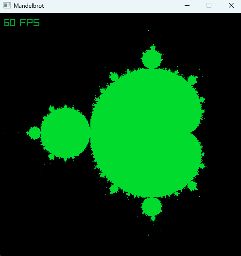

# Graphic Mandelbrot example with benchmarks
* Use **array keys** to move
* Use **mouse wheel** to zoom in/out
* Use **+**/**-** to change iteration count
* Use **S**/**P** to swith between **S**equential and **P**arallel modes
* Use **R** ro reset configuration

